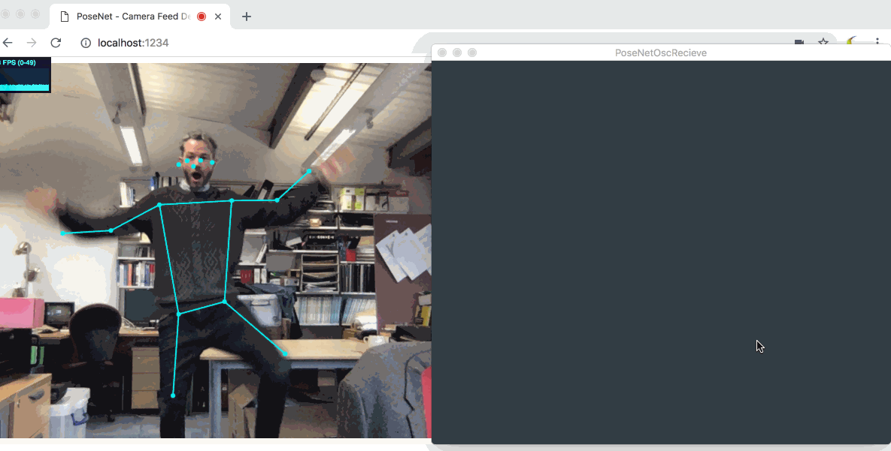

# Juce PoseNetOsc Receive Example

Open `PoseNetOscRecieve.jucer` in the [Projucer](https://juce.com/discover/projucer) and export to your preferred IDE. With the PoseNet webpage open and the `bridge.js` running, body part coordinates will be drawn. 

